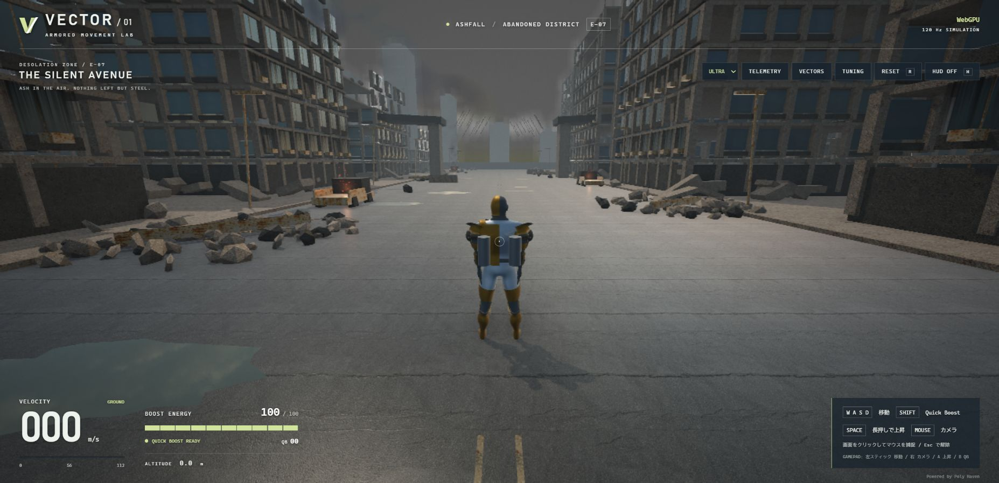

# VECTOR / ASHFALL

荒廃した都市を、ブースターを装備した鎧の戦士で駆け抜ける三人称アクションのプロトタイプです。
Babylon.js・TypeScript・Havokを使い、地上移動、空中操作、全方向へのQuick Boost、ビーム射撃、再生型エネルギー装甲を実装しています。

**[ブラウザーでプレイする](https://suzuking001.github.io/3d_game/)**



## 特徴

- 骨格付きの鎧モデルと、待機・走行・上昇・落下・ブーストのアニメーション
- WASD／ゲームパッドによる移動、慣性、エネルギー管理、ブーストの入力バッファ
- 背部ノズルの方向切り替え、噴射粒子、局所照明、排気付近の熱気による揺らぎ
- 廃墟、瓦礫、煙、灰、濡れた道路と、写真由来のPBR材質・HDR環境光
- カスケード影、SSAO、SSR、光芒、ブルーム、被写界深度、ブースト時のモーションブラー
- 肩部ビーム砲：通常射撃・チャージ射撃、照準への命中判定、共有エネルギー消費
- 白熱するビーム芯、青紫のプラズマ、螺旋放電、砲口の閃光、着弾の衝撃波・火花、合成効果音
- 破壊・再出現する射撃用ドローン、HP表示、ヒットマーカー、肩越しの照準カメラ
- PA / AEGIS FIELD：ダメージを吸収する再生型エネルギー装甲、被弾波紋・屈折・放電・崩壊・再形成
- 120Hzの固定時間刻みによる移動・射撃処理、衝突のすり抜け防止、追従カメラ

現在は移動・描画・ビーム射撃・エネルギー装甲を試すプロトタイプです。ドローンは範囲内の機体にプラズマ弾を撃つ簡易迎撃機能を持ちます。本格的な敵AI、ミッション、セーブ機能は未実装です。

## 遊び方

公開ページをデスクトップのブラウザーで開き、ゲーム画面をクリックしてください。
WebGPUを優先し、使えない場合はWebGL2に切り替えます。モバイルのタッチ操作には対応していません。

| 入力 | 動作 |
| --- | --- |
| W / A / S / D | カメラ基準で移動 |
| マウス | カメラ操作。画面をクリックするとマウスを捕捉 |
| 左ドラッグ | マウス捕捉なしでカメラ操作 |
| Shift | Quick Boost。移動入力がなければ主人公の前方へ噴射 |
| Space 長押し | 上昇ブースト |
| 左クリック / F 長押し | 通常ビームを連射。左クリックはマウス捕捉後 |
| 右クリック / E 長押し → 離す | チャージビーム。約1.15秒で最大出力 |
| R / RESET | 初期位置へ戻り、エネルギー・武器・ドローン・装甲・APをリセット |
| Esc | マウス捕捉を解除 |
| H / HUD OFF | HUDの表示切り替え |

ゲームパッドは、左スティックで移動、右スティックでカメラ、Aで上昇、BでQuick Boost、RTで射撃、LTでチャージです。
標準マッピングの最初のパッドを使用します。実機パッドの動作は未検証です。

通常射撃はEN 4・威力28、最大チャージはEN 30・威力160です。射程は300mで、壁や地面に当たると止まります。HP 100のドローンは通常4発または最大チャージ1発で破壊でき、7秒後に再出現します。
ブーストと射撃は同じエネルギーを使います。フォーカスを失った場合はチャージを取り消します。効果音は最初のキー入力・クリック後から有効になります。
ビームは低音の衝撃・放電・金属共振・短い反響、ブースターは連続する噴射の轟音とQuick Boost開始の破裂音を重ねています。噴射量に応じて音量と音程が変わり、停止時は減衰します。`SOUND ON / OFF`でミュートできます。音はすべて独自に生成しています。

効果音サンプル：[チャージビーム](docs/audio/charged-beam.wav) / [Quick Boost](docs/audio/quick-boost.wav) / [連続噴射](docs/audio/booster-loop.wav)。ゲームでは音量調整とダイナミクス処理も適用します。

### エネルギー装甲

装甲耐久200・本体AP 1000で開始します。有効な装甲は被弾ダメージの94%を吸収し、残りと耐久を超えた分が本体に届きます。装甲は2.5秒間被弾しなければ毎秒32回復します。崩壊後は4秒待ち、耐久50まで回復すると再形成します。本体APは自動回復せず、0になると移動・射撃が停止するのでRでリセットしてください。

通常時は薄い緑の干渉膜、微粒子と局所的な屈折を描画します。被弾箇所から膜上に波紋が広がり、火花と周囲への照明が発生します。崩壊時は全体が瞬間的に発光し、放電粒子が散って消えます。壁の向こうにある装甲の屈折で手前の物体が歪まないよう、深度を参照しています。

ドローンは85m以内で、遮蔽物がなければ速度46m/s・威力34のプラズマ弾を撃ちます。弾は機体の移動も含めて衝突判定します。移動・遮蔽物・ドローン破壊で被弾を避けられます。左下の**迎撃 ON / OFF**で攻撃を切り替えられるので、射撃・移動の練習だけを行う場合はOFFにしてください。切り替えは飛来中の弾も消去します。

画面右上で画質を選べます。

| 画質 | 設定 |
| --- | --- |
| ULTRA | 全エフェクトを使用。標準設定 |
| HIGH | SSR・被写界深度・モーションブラーを省略 |
| LOW | さらにSSAO・光芒を省略し、影・粒子・描画解像度の負荷を軽減 |

動作が重い場合はHIGHまたはLOWに切り替えてください。
`TELEMETRY` はFPSや移動状態、`VECTORS` は方向表示、`TUNING` は移動設定の調整です。

## Windowsでダブルクリック起動

必要環境は **Node.js 22.12以上**（推奨24系）です。
フォルダー内の **[Start-Game.bat](Start-Game.bat)** をダブルクリックすると、
必要に応じて依存を準備・ビルドし、ローカルサーバーとブラウザーを開きます。
起動したウィンドウはプレイ中そのままにし、終了時に閉じてください。
すでに起動中なら同じサーバーを再利用します。ソース更新後は自動で再ビルドします。

ローカルサーバーは `127.0.0.1:5180`～`5199` を使用します。
`index.html` を直接開く方法では、モデルやWASMを正しく読み込めません。
プレイ時にBlenderやPythonをインストールする必要はありません。

## 開発

```bash
npm ci
npm run dev
```

表示されたURLを開きます。標準は `http://127.0.0.1:5173/` です。
`?webgl` を付けるとWebGL2を指定できます。例：`http://127.0.0.1:5173/?webgl&quality=high`。

Google Driveなどの同期フォルダーで依存の展開に失敗する場合は、Windows用の作業コピーを使えます。

```powershell
powershell -ExecutionPolicy Bypass -File .\scripts\Sync-Runtime.ps1 -Install -Task dev
```

依存と実行用コピーを `%LOCALAPPDATA%\vector-mech-lab` に配置します。
2回目以降は `-Install` を省略できます。元フォルダーのソースを編集すると開発用コピーへ同期します。

### 検査とビルド

```bash
npm run typecheck
npm test
node scripts/check-warrior.mjs
npm run build
npm run preview
```

`dist/` が公開用の成果物です。`npm run preview` はローカル確認用サーバーです。
同期フォルダーでは `Sync-Runtime.ps1 -Task test` / `-Task build` を使用できます。
移動・衝突・飛行・カメラ・太陽の20テストと、実際のGLBを読み込む骨格・動作検査があります。

## GitHub Pagesで公開

[.github/workflows/pages.yml](.github/workflows/pages.yml) がテスト・ビルド・公開を行います。

1. GitHubリポジトリの **Settings → Pages** を開く。
2. **Build and deployment → Source** を **GitHub Actions** にする。
3. `main` ブランチへソースをpushする。
4. **Actions → Deploy game to GitHub Pages** の成功を確認する。
5. Pagesの公開URLを開く。

以後は `main` へのpushで更新されます。Actions画面の **Run workflow** からも公開できます。
`dist/` や `node_modules/` をGitへ追加する必要はありません。
GitHub Actionsが `npm ci`、テスト、`npm run build` を実行し、`dist/` だけをPagesへ配信します。

Viteの `base: './'` と共通のアセットURL処理により、`/3d_game/` 配下でも
GLB・テクスチャ・HDR・Havok WASMを読み込めます。
別のアカウントやリポジトリ名へ移す場合は、このREADMEのプレイURLを変更してください。
公開後の更新が見えない場合は、Actionsの成功を確認し、ブラウザーを再読み込みしてください。

公式資料：
[GitHub PagesのActions公開](https://docs.github.com/en/pages/getting-started-with-github-pages/using-custom-workflows-with-github-pages)、
[Viteの静的サイト公開](https://vite.dev/guide/static-deploy.html)。

## 構成

```text
src/                  ゲーム、移動、カメラ、物理、描画、エフェクト
public/               同梱モデル、テクスチャ、HDR、素材のライセンス情報
tests/                移動・物理・カメラのテスト
scripts/              起動、作業コピー、モデル変換・検査
docs/                 設計と検証記録、実画面のキャプチャ
art-source/           ローカルに保管する制作元データ（Git公開対象外）
.github/workflows/    GitHub Pagesの公開ワークフロー
```

主な依存は Babylon.js 9.28、Havok、TypeScript 5.9、Vite 8です。
詳しくは [設計](docs/ARCHITECTURE.md)、[描画](docs/GRAPHICS.md)、
[戦士とブースター](docs/WARRIOR.md)、[検証記録](docs/VERIFICATION.md) を参照してください。

## 素材と利用条件

鎧モデルは crownjoshua の [Knight (Rigged - Mid Poly)](https://opengameart.org/content/knight-rigged-mid-poly)、
材質とHDRは [Poly Haven](https://polyhaven.com/) のCC0素材を使用しています。
骨格をゲーム用に整理し、5動作を新しく作成しています。
出典・加工内容は [素材クレジット](public/ASSET-LICENSES.md) に記録しています。

参考にした他作品のキャプチャはゲーム内素材には使用せず、画像ファイルをリポジトリへ同梱しません。
参考資料には権利者の公開画像へのリンクを記録しています。
このリポジトリのコードには、現時点では独自のオープンソースライセンスを指定していません。
CC0素材の利用条件と、コードの利用条件は別です。

## 現在の制約

建物は手続き生成で、衝突は静的な軸平行の体積を使います。
傾斜面・動的障害物・精密な破壊は未対応です。
高速度の移動はゲーム用の設定で、通常の人間の走行速度を再現するものではありません。
熱気は画面上の屈折による近似で、流体や熱伝導を計算していません。

描画速度はPC・ブラウザー・画質に依存します。
検証ブラウザーでは全画質で約4fpsと表示されたため、60fpsの達成は確認できていません。
現在の動作検査とフレーム速度の検証範囲は [戦士の検証記録](docs/WARRIOR.md) を参照してください。
