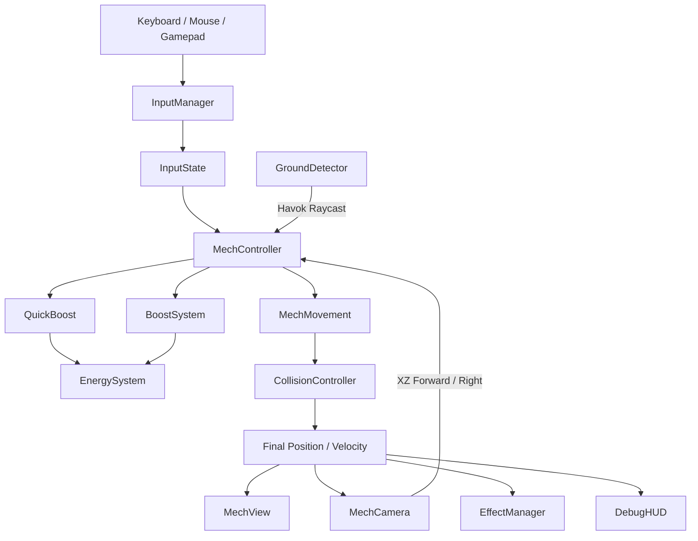
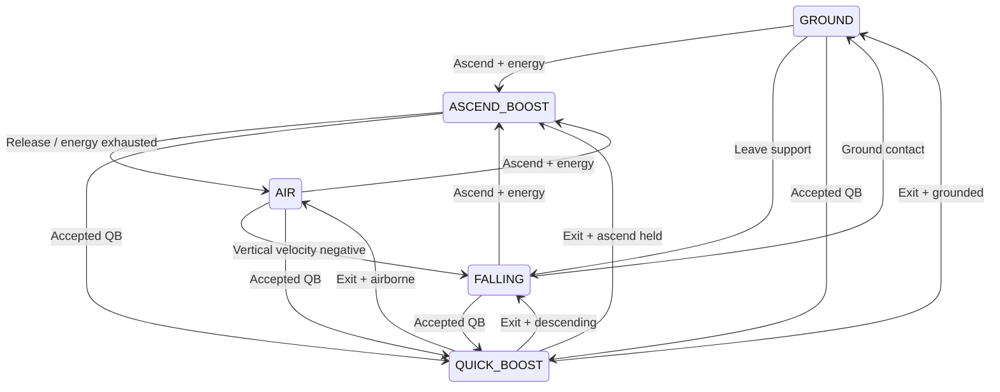
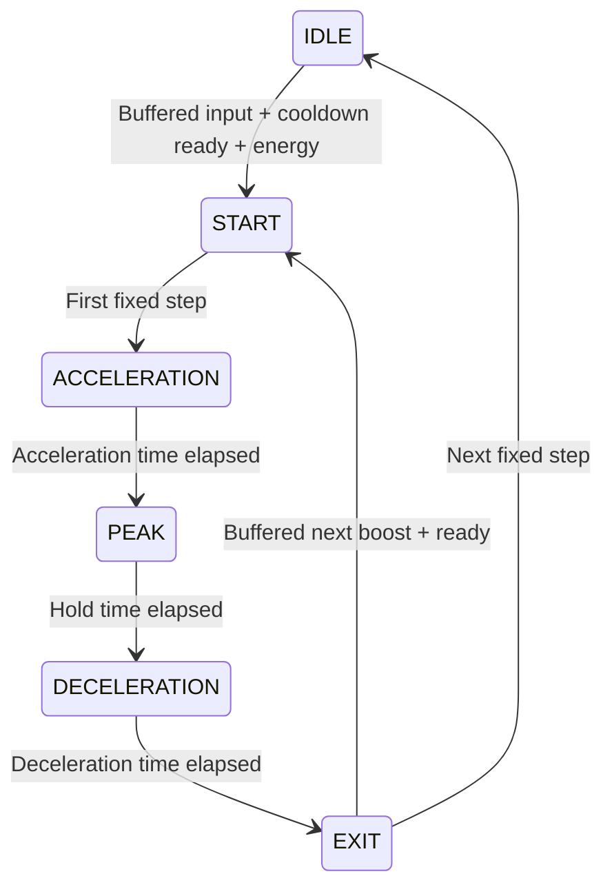

# VECTOR Phase 1 設計

## ディレクトリと責務

| ディレクトリ | 主なクラス | 責務 |
|---|---|---|
| core | Game / GameLoop / TimeManager / SceneManager | 配線、120Hz固定刻み、描画バックエンド・Havok初期化 |
| input | InputManager / InputState | キーボード・マウス・ゲームパッドを正規化、入力エッジ保持 |
| player | MechController / MechMovement / MechState | 入力方向・状態遷移、速度解決、描画とは独立した移動 |
| player | QuickBoost | 入力バッファ・クールダウン、QB方向と5段階速度曲線 |
| player | BoostSystem / EnergySystem | 上昇・浮遊・重力、エネルギー消費・遅延回復・不足フィードバック |
| player | MechView | プリミティブ機体の表示のみ |
| camera | MechCamera / CameraEffects | 独立リグ、追従・遮蔽対策、FOV・イベント振動・ロール |
| physics | CollisionController / GroundDetector | 連続スイープ・接触解決、Havok接地レイキャスト |
| graphics | Environment / Lighting / PostProcessing | Grayboxと同じ形状の静的Havokボディ、簡易照明、任意Bloom |
| effects | EffectManager / ThrusterEffect / QuickBoostEffect | 固定プールの軌跡、排気・ショックウェーブ |
| debug | DebugHUD / DebugRenderer | 全必須計測項目、Config調整、7種類の3Dベクトル |
| config | MechConfig / CameraConfig / GraphicsConfig | 移動・カメラ・描画の集約設定 |
| combat | TargetingSystem / WeaponSystem / ProjectileSystem | Phase 2向けインターフェースのみ、未実装 |



## 入力とループ

物理入力をGameplayから直接読み取らない。WASDとパッド左スティックは単位円内へ正規化する。マウスと右スティックはカメラ角度へ変換する。Shift/Bは押下エッジ、Space/Aは長押し。キーリピートはQBを発生させない。フォーカス喪失・ページ非表示・Pointer Lock解除時に入力をクリアする。

フレーム開始時に入力を取得し、カメラのXZ基準を更新する。押下エッジは最初のシミュレーションステップでのみ消費し、ステップのない描画フレームでは保持する。

```text
frameDelta = min(realDelta, maxFrameDelta)
InputManager.sample(frameDelta)
MechCamera.readLook(input)
accumulator += frameDelta
while accumulator >= 1 / simulationHz:
    previousPosition = position
    desired = cameraForward * forward + cameraRight * right
    update state / QB / vertical boost / velocity
    continuous collision sweep -> slide -> ground probe
    energy.update(fixedDelta)
    consume input edges
    accumulator -= fixedDelta
renderPosition = lerp(previousPosition, position, accumulator / fixedDelta)
view / camera / effects / HUD / scene.render
```

非表示時はシミュレーションを停止し蓄積時間をリセットする。長いフレームは最大100ms分だけ処理し、極端な停止後の追いつき計算を抑える。したがって10FPS未満や大きな停止では現実時間に対してスローモーションとなる。通常の30〜144FPSでは移動量は同じ固定刻みで決まる。

## 移動状態



状態表示の優先度はQB、上昇、接地、落下、空中。垂直速度はQB中にも解決され、着地・上昇との連続性を保つ。

## QBの速度モデル



デフォルトはピーク112m/s、加速55ms、維持65ms、減速140ms、終了速度47.04m/s（保持率42%）。クールダウン300ms、入力バッファ160ms、消費18EN。

```text
0ms            55ms          120ms                     260ms
START / ACCEL  | PEAK        | DECELERATION             | EXIT
startSpeed     | 112         | 112 -> 47.04             | retain
     _________/______________\_________________________
```

```text
startSpeed = max(0, dot(currentVelocity, qbDirection))
ACCEL: speed = lerp(startSpeed, peak, 1 - (1 - t)^3)
PEAK:  speed = peak
DECEL: speed = lerp(peak, peak * retention, t*t*(3 - 2*t))
EXIT:  speed = peak * retention
velocityXZ = qbDirection * speed
position = collision.solve(position, velocity * fixedDelta)
```

EXITの次のステップから通常速度へ加速度制限付きで近づける。無入力でもゼロへ即時リセットしない。反転QBは新方向への非負の投影速度から立ち上がる。QB方向の修正は `1-exp(-steeringInfluence*dt/accelerationTime)` の補間を使い、通常操舵より小さくする。方向は開始時のカメラ基準入力、無入力なら機体前方。

## カメラ

機体の補間位置 → 高さを足したターゲット → 指数補間する独立リグ → 視点。機体へparentしない。QB中は速度比率に応じて追従応答を下げ、FOVを拡張する。FOVの拡張と復帰で別の応答速度を使用する。横QBでは小さなロールを付ける。振動はQB開始・着地のイベントで発生し減衰する。ターゲットから視点へのレイで環境による遮蔽を回避する。将来のロックオンは `setLockTarget` で注視点へ合成できる。

## 衝突

Phase 1の軸平行ボックスに限定した連続衝突。機体は半径×半高さの保守的な直立ボックスで扱う。障害物を機体の半サイズだけ拡張し、前位置から移動ベクトルをスイープする。最も早い接触時刻まで移動し、法線方向の残り変位と速度を取り除いて再スイープする。薄い壁にも移動距離と独立した衝突判定を行う。小さなskin間隔でも接地を維持する。

環境の衝突ボックスと静的Havokボディは同じ生成関数から作る。接地判定と地面法線取得はHavokレイを併用する。プレイヤーはRigidBodyの力・Impulseで移動しない。将来の傾斜面・任意GLB地形・動的障害物はHavok Shape Cast等へ拡張が必要。現在のスイープを任意Meshに対して使えるとは扱わない。

## Configと拡張

MechConfigに移動・QB・Energy・衝突・入力、CameraConfigに視点・演出、GraphicsConfigに環境・描画品質・エフェクトプールを集約する。Developer UIは同じ設定オブジェクトを変更する。速度、加速時間、慣性、空中制御、カメラ遅延、FOVは再起動なしで反映する。シミュレーションHzと最大蓄積時間はTimeManager生成時の設定で、再起動が必要。

Effectsはイベントと移動結果を参照するだけ。軌跡は起動時に確保した40個のMeshを循環利用する。移動計算の作業Vectorは再利用する。HUDは約12.5Hzで更新する。戦闘クラスとExplosionEffectは接続インターフェースのみを用意し、Phase 1では武器・AI・ダメージ等を実装しない。

## 実装順

1. Babylon.js / TypeScript / Vite設定
2. Graybox / primitive mech
3. 正規化入力
4. 地上移動
5. 三人称カメラ
6. 接地・重力
7. 空中移動
8. 上昇・Energy
9. QB曲線
10. 慣性引き継ぎ
11. 入力バッファ・連続QB
12. Camera lag / event shake / small roll
13. FOV補間
14. 連続スイープ・壁滑り
15. HUD・ベクトル
16. Developer tuning

Babylon公式のPhysics v2構成とWebGPU初期化を参照:
- https://github.com/BabylonJS/Documentation/blob/master/content/features/featuresDeepDive/physics/v2/usingPhysicsEngine.md
- https://github.com/BabylonJS/Documentation/blob/master/content/setup/support/webGPU.md
- https://github.com/BabylonJS/havok
