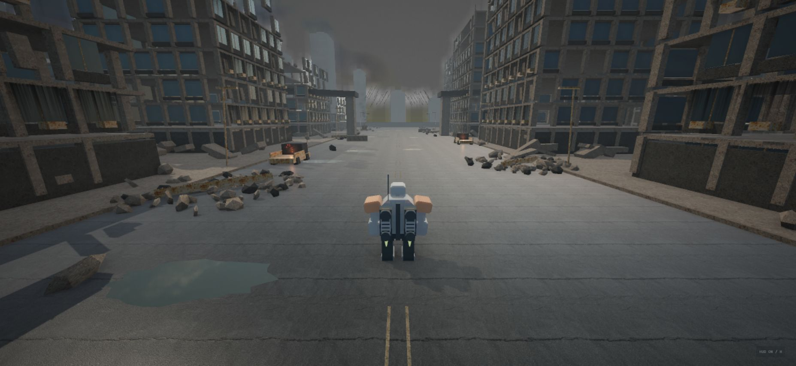
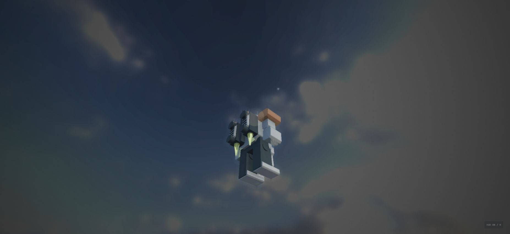

# ASHFALL / Graphics

2026-09-27。灰色の検証フィールドを、雨に濡れた廃工業都市へ変更しました。参考に取得した実ゲームのキャプチャ4枚は [参考画像一覧](references/index.html) で確認できます。

## 実装

| 構成 | 内容 |
|---|---|
| 街区 | 18棟のモジュール式廃ビル、38棟の遠景、崩れた高架、露出鉄筋、窓、空調機、煤・雨だれ |
| 地表 | 実写由来の2Kアルベド／法線／粗さマップ、ひび割れ路面、破片の集積、落下鉄骨、焼けた車両、バリケード、不規則な水たまり |
| 機体 | 面取りした装甲、排熱フィン、丸い排気口、油圧部品、警告色、PBR金属、発光センサー |
| 光・影 | HDR IBLと空、暖色の太陽光、4カスケード・2048px PCF影、SSAO2の接触陰影、炎の揺らぐ点光源 |
| 反射 | PBR環境反射、クリアコート、SSRの画面内反射 |
| 空気 | 距離霧、光芒、3か所の上昇煙・火の粉、風に舞う灰 |
| 画面処理 | ACES、低彩度と暖冷色の調整、HDRブルーム、弱い被写界深度、ビネット、粒子感、弱い色収差、FXAA／4x MSAA、シャープネス |
| 高速移動 | QB強度に応じたスクリーン空間モーションブラー、既存の残像・推進炎・FOV変化 |

静的な形状は材質ごとにまとめて描画し、衝突形状を独立させています。水面と汚れは別描画です。HDR背景は光芒の遮蔽物から除外し、WebGPUのアルファマスク描画との不整合を回避しています。

## 飛行時の太陽と光源効果

地上125mに固定されていた太陽を廃止。太陽はカメラから仰角55度、方位角-35度、描画用距離1,000mの位置に毎フレーム追従し、近づけない遠景として扱います。直径は角度0.53度から計算し、上昇しても見かけの大きさを保ちます。1,000mは天体の実距離ではなく描画用の値です。

影・太陽像・光芒が同じ方向を参照します。太陽周囲には柔らかな散乱ハロー、カメラには弱いレンズフレアを追加。建物による遮蔽を光芒のマスクとフレアのレイ判定に使用します。これらは画面処理による近似で、実際の雲の体積散乱や気象モデルではありません。HDRに焼き込まれた雲は光源を動的に遮蔽しません。

上のキャプチャは確認用コピーで開始高度350m・落下重力0・上向き画角を設定して撮影しました。通常版の開始位置と重力は元の設定に戻しています。見上げ可能なカメラ範囲は拡張しています。

## 起動と画質

- Ultra（標準）: `http://127.0.0.1:5173/`
- High: `http://127.0.0.1:5173/?quality=high`
- Low: `http://127.0.0.1:5173/?quality=low`
- WebGL2を指定: `?webgl`。画質指定と併用する場合 `?webgl&quality=low`。
- HでHUDの表示を切り替えます。Rで初期位置へ戻ります。
- 画面右上のULTRA／HIGH／LOWで切替できます。切替時はフィールドを再起動します。

描画の設定は `src/config/GraphicsConfig.ts`。露出・霧・影・粒子数をまとめています。素材の出典とライセンスは [ASSET-LICENSES.md](../public/ASSET-LICENSES.md)。実行時の素材はすべてローカル配信します。

## 品質の限界

写真素材によるPBRと画面効果を広く使用していますが、建物・機体は手続き生成です。精密なスキャン済み破壊モデル、人物、植生、実時間GI、レイトレーシングは導入していません。SSRは画面外の形状を反射できません。影と霧は近似で、動的な破壊もありません。AAAゲームや写真と同等とは評価していません。

標準Ultraは画質を優先して負荷が高く、60FPSの達成は未確認です。低FPS時はHigh/Lowを選択してください。衝突は静的AABBの保守的な体積なので、見た目の細かな破片・窓の開口・高架の傾斜とは完全には一致しません。フィールド外周には飛行範囲を制限する体積があります。
