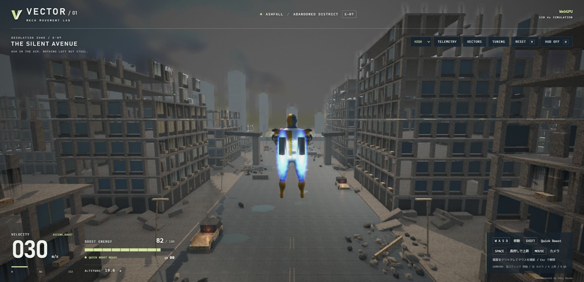
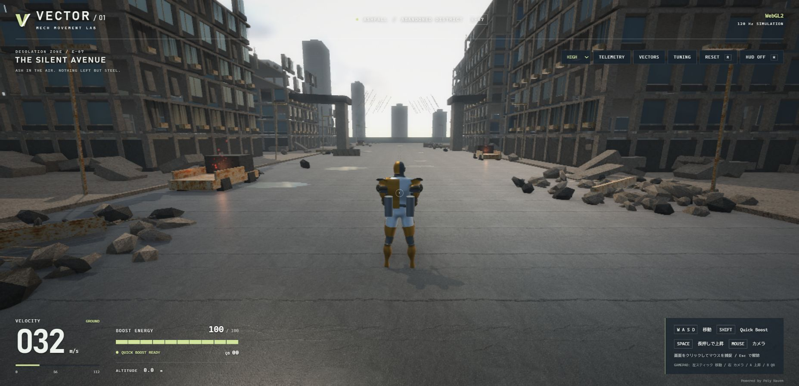

# 鎧の戦士とブースター

箱型の主人公を、crownjoshua の CC0 Knight を加工したスキニング付き人型へ置き換えました。
出典とライセンスは `public/ASSET-LICENSES.md` に記録しています。
モデルはゲーム同梱の GLB（約1.3 MB）なので、プレイ中の外部モデル配信に依存しません。

制作用 Rigify を23ボーンに整理し、待機・走行・高速ブースト・上昇・落下の5動作を新規に作りました。
元モデルのアニメーションは鎧の表示用で、歩行モーションではありません。
速度と接地・上昇状態に応じて動作を選び、重みを滑らかに切り替えます。
走行の再生速度は移動速度に応じて変化します。判定・固定時間刻みの移動処理は従来のものです。
高速移動は従来のゲーム設定を維持しているため、通常の人間の走行速度を再現するシミュレーションではありません。

鎧は PBR の金属・粗さと CC0 の汚れ／法線テクスチャで描画します。
背部の噴射装備は胸の骨格の位置に追従し、高速ブーストで後方、上昇で下方へ向きます。
排気は固定容量の粒子、白青色の発光、局所照明、消火時の短い減衰を組み合わせています。
旧式の緑色の箱型残像と、硬い円錐の噴射炎は廃止しました。

熱気は WebGL2 用 GLSL と WebGPU 用 WGSL の専用ポスト処理で近似しています。
噴射位置を画面へ投影し、その近くの背景だけに時変の屈折を加えます。
深度によって手前の物体を保護し、噴射を止めると揺らぎも減衰します。
実際の流体・熱伝導の計算ではなく、画面上の視覚効果です。

## 再生成と確認

通常起動に Blender/Python は不要です。`Start-Game.bat` で起動できます。
モデルを再生成する場合だけ、Python 3.13 のローカルツール用ディレクトリへ
`bpy==5.2.2` をインストールし、`scripts/fetch-warrior-assets.py` と
`scripts/export-warrior.py` を実行します。ツールの配置場所はスクリプト内に記載しています。
外部 blend 内のスクリプトは `use_scripts=False` で読み込みます。

`scripts/check-warrior.mjs` は Babylon NullEngine に実際の GLB を読み込み、
骨格数、5動作、待機時の腕の変形、走行時の腕・膝の変化、行列の有限性を確認します。
ローカル依存関係のある作業用コピーで `node scripts/check-warrior.mjs` を実行してください。
型検査・移動／衝突／飛行の20テスト・本番ビルドも確認しています。

実画面は WebGL2/HIGH と WebGPU/HIGH、および本番 WebGPU/ULTRA で確認しました。
ULTRA の初回描画で SSAO のカメラが未設定のまま処理される問題を修正しています。
Babylon 9.28 の内部 Thin SSAO カメラへ初期値を設定する互換処理なので、エンジン更新時に再確認してください。
検証ブラウザーの表示は ULTRA/HIGH/LOW とも約4fps・250msでした。
画質を下げても同じ値なのでブラウザー側の制限が疑われますが、原因は確定していません。
この環境では滑らかな実機フレーム速度を確認できていません。60fpsを保証するものではありません。
`warrior-flight.png` と `warrior-run.png` は操作を再現する検証用コピーで撮影しています。
`scripts/prepare-warrior-review.mjs` は LOCALAPPDATA の開発用コピーにだけ入力を注入します。
`?review=run` / `?review=ascend` / `?review=boost` で3秒周期の確認ができます。
本番ビルド前に `Sync-Runtime.ps1 -Task none` で元へ戻す必要があります。
配布用ビルドには自動操作は含めません。

